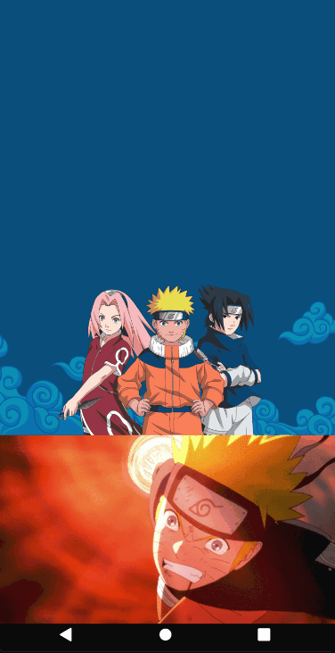
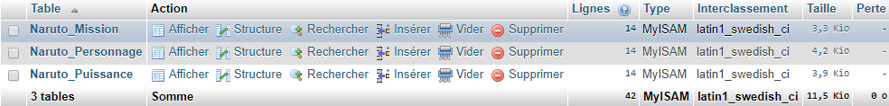
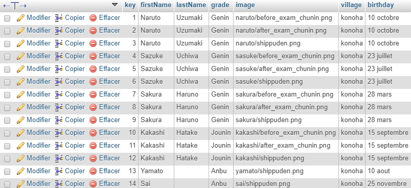
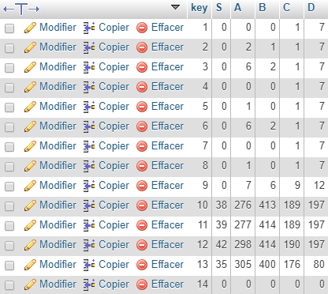
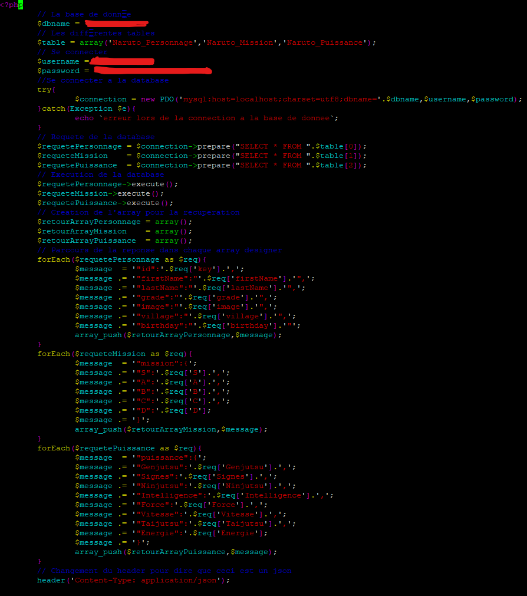

# Naruto Api Mobile
## Presentation
```Naruto Api Mobile``` est une application mobile qui utilise sa propre api à partir des données du databook créer par l'auteur.

Lors de l'appelle de l'application une courte animation se lance (Naruto utilisant un rasengan), puis nous avons une liste de tout les personnages, quand nous cliquant sur un des personanges nous avons les descriptifs du personnages cliqué. Les descriptifs sont séparé en deux catégories:
* Capacité
> C'est les compétences du personnages définit dans un datagramme
* Description
> C'est tout ce qui est informative sur le personanges (Âges,Pays, ...)



## Attente du projet

Le projet doit contenir et contient :
* Des Fragments
* Appel WebService à une API Rest
* Design
* Architecture MVC
* Git

Le projet contient en plus :
* L'utilisation de gif
* L'utilisation d'une bottom-bar
* L'utilisation de sa propre api (Serveur + base de donnée + Herbergeur)
* Une custom View
* Sauvegarde des données si on coupe internet

## Utilisation de l'api
```Naruto Api Mobile``` est une application mobile qui utilise sa propre api : http://ns202518.ovh.net/mehdi/api/naruto/. Cette api est concu avec les données des databooks créer par l'auteur :http://naruto.japflap.com/world-personnages-biographie-Naruto. L'api appelle un site web qui retourne la base de donnée du serveur 

### Base de donnée
Dans cette base de donnée nous avons troix tables :
* **Naruto_Personnage**, s'occupe de tout la parti informative du personnage (Nom,Prénom,Date de naissance,rang,pays, grade)
* **Naruto_Mission**, s'occupe des données de type nombre de mission de rang A,B,C,D,S effectuer
* **Naruto_Puissance**, s'occupe des données dans capacité (Ninjutsu = ..., Taijutsu = ..., etc)






### Site web

Le site web qui retourne l'api est codé en php, dans ce code php nous parcourons la base base de données, il faut que tout les lignes des tables de base de données ai le même nombres, car chaque personnages a un decriptif sur la puissance, les missions faites et les informations personnels. Celui-ci parcours l'indice en indice à partir de Naruto_Personnages.




## Codage Android
### Structure MVC
Le code est structuré en MVC (Model View Controler) :

```
project
|
└─model
| └─api
| | | Api.java
| | | GetApi.java
| | | Link.java
| | | SingletonStorage.java
| |
| └─personnage
|   | Personnage.java
|
└─view
| └─activity
| | | DetailActivity.java
| | | MainActivity.java
| | | StartActivity.java
| |
| └─design2D
| | | CapaciteLine.java
| |
| └─fragment
|   | FragmentCapacite.java
|   | FragmentDescription.java
|
└─controler
  └─activity
  | | MainContoler.java
  |
  └─canvas
  | | DatagrammeCapacite.java
  |
  └─recyclerView
    | RecyclerViewCharacter.java
    | RecyclerViewAdapteur.java

```
### Model
Dans le model nous avons le stockage de la data, les liens internet, ainsi que l'apelle de l'api.

* Les liens internet sont dans Link.java.
* L'appelle de l'api est gérée par SingeletonStorage.java, GetApi.java et Api.java
* Le stockage de la data est dans Personange.java

### View 
Dans View nous avons les differentes activités :
* **StartActivity.java**, qui affiche une animation dès le début puis quand c'elle-ci ce finit alors MainActivity est appellé.
* **MainActivity.java**, qui affiche une recyclerView de personnage et quand un personnage est cliqué alors MainActivity appelle DetailActivity avec le personnage cliqué en paramètre.
* **DetailActivity.java**, qui affiche les details d'un personnage. Celui a deux fragment:
    * **FragmentCapacite.java**, affiche les capacité du personnage (Ninjutsu, ...), celle-ci affiche un datagramme et ce datagramme est contenue dans **CapaciteLine.java**.
    * **FragmentDescription.java**, affiche la description du personnage.

### Controler
Dans  les controler nous avons 3 types de controler :
* **MainControler.java** : qui est rattaché au **MainActivity**, il s'occupe d'appeller l'api ainsi que de donner les elements au recyclerviewCharacter.
* **DatagrammeCapacite.java** : qui donne le canvas a affiché en fonction des donnée retourné par l'api, c'est lui qui donnera l'affichage graphique du datagramme.
* Liées au recyclerView :
    * **RecyclerViewCharacter.java**, il génere la liaison entre la recyclerView et l'adapteur créer.
    * **RecyclerViewAdapteur.java**, il permet de définir ce que contiendra la recyclerView. Donc il définit chaque élement de la recyclerView
